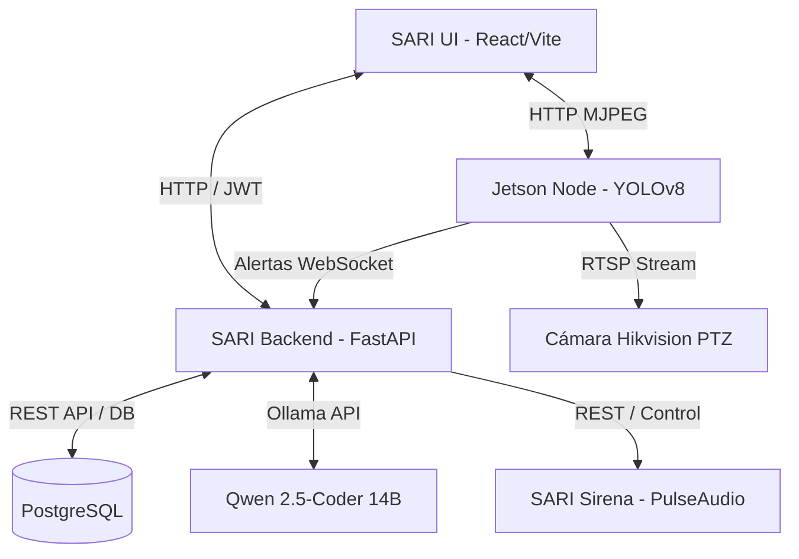

# SARI SOC — Arquitectura & Operación del Sistema

Sistema Autónomo de Respuesta a Intrusiones (SARI) conectado a hardware físico y control perimetral mediante inteligencia artificial.

---

## 🏗️ Diagrama de Arquitectura General

El sistema está dividido en cuatro módulos principales que se comunican mediante HTTP REST y WebSockets:

---

## 📦 Componentes del Sistema

### 1. **SARI UI (Frontend)**
*   **Tecnologías**: React, Vite, TypeScript, Vanilla CSS (diseño responsivo oscuro carmesí `#ff3366`).
*   **Características**:
    *   **Chat Multihilo**: Permite conversar en tiempo real con la IA táctica, con enfoque automático continuo de casilla y difuminado suave en extremos superior e inferior.
    *   **Live Perception**: Reproductor de video HTTP/MJPEG en tiempo real para visualizar la cámara **Jetson-PTZ_1** con presets rápidos.
    *   **Hardware Control**: Panel interactivo con Radar perimetral de barrido, telemetría de CPU/Red del sistema y D-Pad para control PTZ de la cámara Hikvision.
    *   **Botonera de Emergencia**: Botones en cabecera para activación rápida con un solo clic (`Sirena 30s`, `Bloquear Portones`).

### 2. **SARI Backend (Cerebro Core)**
*   **Tecnologías**: FastAPI (Python), SQLAlchemy, PostgreSQL, Uvicorn.
*   **Características**:
    *   **Persistencia**: Guarda hilos y mensajes utilizando Base de Datos PostgreSQL.
    *   **IA Local**: Integra llamadas locales a Ollama (`qwen2.5-coder:14b`) para analizar incidencias de seguridad y responder al operador.
    *   **Control Físico**: Administra el estado global de los actuadores físicos (`HardwareState`) e inserta registros dinámicos de inicio en el historial.

### 3. **SARI Ojos (Nodo de Percepción - Jetson Orin)**
*   **Tecnologías**: Python, YOLOv8 (Ultralytics), OpenCV, Flask.
*   **Características**:
    *   **Detección de Intrusos**: Captura la transmisión RTSP de la cámara Hikvision, corre inferencia en tiempo real acelerada por hardware CUDA/TensorRT y notifica incidencias al Cerebro.
    *   **Servidor MJPEG**: Expone un flujo compatible con navegadores en el puerto `8080/mjpeg` con transporte TCP forzado para prevenir congelamiento.

### 4. **SARI Sirena (Servicio de Audio)**
*   **Tecnologías**: Python (HTTP Server), PulseAudio (host), `espeak-ng`.
*   **Características**:
    *   **Audio Físico**: Mapea el socket Unix de PulseAudio del host hacia el contenedor Docker para reproducir alertas sonoras en las bocinas de la laptop.
    *   **TTS Táctico**: Emite anuncios de advertencia hablados en bucle durante la duración de la alerta.

### 5. **NeMoClaw MCP Server (Odysseus)**
*   **Tecnologías**: Model Context Protocol (MCP), Python.
*   **Características**:
    *   Expone herramientas del mundo real (`activar_sirena`, `desactivar_sirena`, `cerrar_accesos`) para que el agente autónomo actúe sobre el perímetro físico.

---

## ⚡ Flujo de Trabajo en Intrusión

1. **Detección**: El módulo **SARI Ojos** identifica a un intruso con confianza $\ge 70\%$.
2. **Notificación**: Envía un evento POST a `/api/alerts/event` en el backend.
3. **Respuesta Física**: El Cerebro llama al servicio **Sirena** para hacer sonar la alerta de voz.
4. **Log**: Se añade una entrada de nivel `ERROR` en el **Registro de Eventos (Event Logs)** de la interfaz web.
